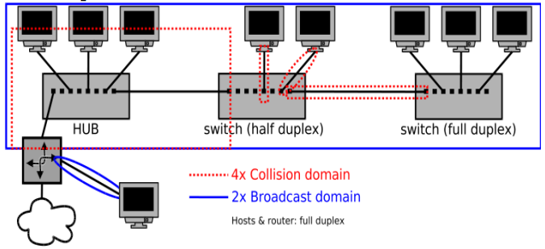
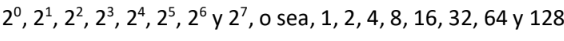
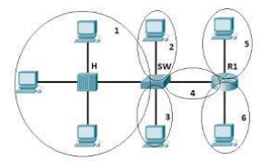
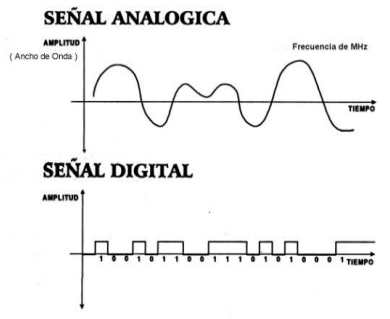

# Primer parcial

### Conceptos básicos.

* LAN (Red de área Local)
    * Misma área geográfica
    * Estructura organizacional común
    * Administrada por una única organización
* WAN (Redes de área amplia)
    * Ubicaciones separadas geográficamente
    * Dispositivos de red especiales
* Comunicación half-duplex
    * Los dispositivos pueden transmitir y recibir en el medio pero no al mismo tiempo
* Comunicación full-duplex
    * Los dispositivos pueden transmitir y recibir en el medio al mismo tiempo
* Topología física (Bus, Anillo, Doble Anillo, Estrella, Malla, Árbol, Mixta)
    * Disposición real de medios (en el entorno físico)
    * Configuración de nodos y conexiones
    * Representación de uso de los medios
* Topología lógica (Broadcast / transmisión de tokens)
    * Maneras de transmitir paquetes
    * Conexiones virtuales
* Dispositivos de usuario final
    * Computadoras
    * Celulares
    * Impresoras
    * IOT
* Dispositivos de Red
    * Repetidores
    * Hubs
    * Puentes
    * Switches
    * Routers
    * Firewalls



* ASCII
    * usa dígitos binarios para representar los símbolos que se escriben con el teclado
* Bits
    * número binario (0 = 0 Voltios / 1 = +5V)
* Bytes
    * agrupaciones de ocho bits
* Sistema numérico de Base 2



* Hexadecimal (hex)
    * son los números 0 - 9 y las letras A, B, C, D, E y F
    * La palabra hexadecimal a menudo se abrevia como 0x
    * 0x2102 = 0010000100000010
* Dominio de colisión
    * espacio físico con un ancho de banda compartido por un conjunto de dispositivos
    * existe la posibilidad de que sus mensajes colisionen el espacio compartido o bien no se pueda asegurar que al receptor le ha llegado el mensaje
    * Para resolverlo, Ethernet implementa CSMA/CD (Carrier dense multiple access with collision detection).
    * Rendimiento = (1-(Colisiones/Paquetes Totales))*100
* Dominio de difusión (Broadcast)
    * El dominio de difusión es la división lógica de la red dentro de la cual los dispositivos envían mensajes de difusión, también llamados broadcast.switch
    * Dos dispositivos dentro del dominio de difusión comparten puerta de enlace (gateway), dirección de subred y pueden transmitir a otro dispositivo dentro del dominio sin precisar encaminamiento; es decir, se encuentran en la misma LAN
    * Los dominios broadcast o de difusión están delimitados por routers
* HUBS
    * concentradores extienden el dominio de colisión ya que reenvían todos los mensajes que reciben de un dispositivo a los otros dispositivos conectados.
* SWITCHES
    * conmutadores segmentan los dominios de colisión, pero expanden el dominio de difusión
* ROUTERS
        ◦ también segmentan los dominios de colisión, pero además también lo hacen con los de difusión



> ROUTER (R1). Ordenador 5 se encuentra en un solo dominio de difusión, al igual que el ordenador 6; el resto (1,2 y 3) se encuentran en otro. Hay 3 dominios de difusión. Los dominios de colisión están señalizados con un circulo en la imagen. El HUB extiende el dominio de colisión, por eso el Dominio de Colisión 1 tiene 3 dispositivos conectados.

* MULTIPLEXACION
    * Técnica de combinar dos o más señales, y transmitirlas por un solo medio de transmisión
    * Multiplexación por división de frecuencias (FDM)
    * Multiplexación por división en el tiempo (TDM).
    * Técnicas combinadas
* Medicion
    * Ancho de banda
    * Throughput
    * Tasa de conexión
    * Velocidad de descarga / carga
* Señales




# Segundo Parcial
### Modelo OSI y PDU

* Capa física (Define todas las especificaciones eléctricas y físicas de los dispositivos): La PDU en esta capa se llama bit.
* Capa de enlace de datos (Proporciona direccionamiento físico y procedimientos de acceso a medios): La PDU en esta capa se llama trama (frame en inglés).
* Capa de red (Responsable del direccionamiento lógico y el dominio del enrutamiento): La PDU en esta capa se llama paquete (packet en inglés).
* Capa de transporte (Proporciona transporte confiable y control del flujo a través de la red): La PDU en esta capa se llama segmento.
* Capa de sesión (Establece, administra y finaliza las conexiones entre las aplicaciones locales y las remotas): La PDU en esta capa se llama dato.
* Capa de presentación (Transforma el formato de los datos y proporciona una interfaz estándar para la capa de aplicación): La PDU en esta capa se llama dato.
* Capa de aplicación (Responsable de los servicios de red para las aplicaciones): La PDU en esta capa se llama dato.

### Diseño jerárquico 

El beneficio de dividir una red plana en bloques más pequeños y fáciles de administrar es que el tráfico local sigue siendo local. Sólo el tráfico destinado a otras redes se traslada a una capa superior.

* Capa de núcleo: proporciona un transporte rápido entre los switches de distribución dentro del campus empresarial.
* Capa de distribución: proporciona una conectividad basada en políticas y controla el límite entre las capas de acceso y de núcleo.
* Capa de acceso: proporciona acceso a la red para los grupos de trabajo y los usuarios.

### VLANs (Virtual Local Area Networks)

* Segmentación de red: Las VLANs permiten dividir una red en múltiples segmentos lógicos, lo que brinda mayor seguridad, eficiencia y control en la administración de la red.
* Aislamiento de tráfico: Cada VLAN es independiente y aísla su tráfico del resto de las VLANs, lo que evita la propagación de paquetes no deseados.
* Flexibilidad: Las VLANs pueden agrupar usuarios o dispositivos con características comunes, independientemente de su ubicación física, facilitando la administración y el control de la red.
* Tráfico de VLAN: Para permitir la comunicación entre VLANs, se pueden utilizar dispositivos de capa 3, como enrutadores, o bien, configurar enlaces de trunking que permitan el paso de múltiples VLANs a través de un único enlace físico.

### VTP (VLAN Trunking Protocol)

* Distribución automática de VLANs: El VTP permite la distribución automática de información de VLANs a través de la red, simplificando su configuración y evitando la necesidad de configurar cada switch de forma individual.
* Dominios VTP: Los switches Cisco se agrupan en dominios VTP para facilitar la propagación de la información de VLANs. Los switches en el mismo dominio VTP comparten información de manera transparente. 
* Modos de funcionamiento: Los switches Cisco pueden operar en tres modos de VTP: servidor, cliente y transparente. Cada modo tiene sus propias características y reglas de actualización de VLANs.
* Seguridad VTP: Se deben tomar precauciones para evitar cambios no deseados en la configuración de VLANs a través de autenticación y control de revisiones.

### CDP (Cisco Discovery Protocol)

* Descubrimiento de vecinos: CDP permite a los dispositivos Cisco descubrir y obtener información sobre los dispositivos vecinos conectados directamente a través de los enlaces de red.
* Información de vecinos: CDP proporciona detalles sobre los vecinos, incluyendo su tipo de dispositivo, plataforma, direcciones IP y capacidades de la interfaz.
* Resolución de problemas: CDP facilita la identificación de dispositivos directamente conectados y ayuda en la resolución de problemas de conectividad y configuración.
* Interoperabilidad: Aunque CDP es un protocolo propietario de Cisco, algunos fabricantes de dispositivos de red pueden admitir CDP o protocolos similares para permitir la interoperabilidad con equipos Cisco.

### Comandos

#### VLAN

Determinar los puertos Trunk por lo que van a pasar todas las VLANs:

* En SW  (switch) de acceso, usar el puerto 1 y en el SW (switch) distribución todos trunk  
  
* En el switch DISTRIBUCION definimos como puertos trunk los veinticuatro de SW DISTRIBUCION:  

```
interface range fastEthernet 0/1-24
switchport mode trunk
```
  
* En los sw ACCESO  cada SW debemos marcar 1 puerto trunk 

```
interface fastEthernet 0/1
switchport mode trunk
```

* El resto de los puertos en modo ACCESS y su VLAN asignada:

```
interface range fastEthernet 0/2-24
switchport mode access
switchport access vlan X
```
  
* Crear las subredes para cada interfaz (ejemplo):  

```
interface fastethernet 0/0.10
encapsulation dot1q 10
ip address 192.168.10.1 255.255.255.0
exit
```
  
* Crear VLANs en todos los SW

```
vlan X (ejemplo vlan 10)
vlan 10
name "nombre"
exit
```

* Ver VLANs existentes 

```
show vlan
```
  
* En caso de un error, por ejemplo al configurar una VLAN, anteponer el "no" al comando. vlan 10 name "nombre" ejecutar: ```no vlan 10```

#### VTP
  
* Asignar modo VTP server (por default ya son server)  

```
vtp mode server
vtp domain ISTEA
vtp password istea
  
show vtp status
```

* Entrar a los switch que serán clientes:  
```
enable
config terminal
vtp mode client
vtp domain ISTEA
vtp password istea
```

* Configurar los rangos de interfaces:  

```
enable
config terminal
interface range fastethernet 0/2-5
switchport mode access vlan X
```

* Crear los pool DHCP:

```
ip dhcp pool NombreDelPool
network 192.168.10.0 255.255.255.0        #(IP Mascara De Subred)
default-router 192.168.10.1               #(aquí default gateway)
dns-server 192.168.10.2                   #(El servidor DNS de la red)  
exit
```

* Excluir las ip que vamos a asignar manualmente:  

```
ip dhcp excluded-address 192.168.10.2
ip dhcp excluded-address 192.168.10.1
```

* Visualiza configuración actual del router o switch 

```
show running-config
```
  
* Guarda la configuración actual en la configuración al inicio del dispositivo:  

```
copy running-config startup-config
```
(o abreviado) 
```
wr
```
  
* Configuramos la dirección IP de la interface fastEthernet 0/0

**En router:**
```
enable
configure terminal
interface fastEthernet 0/0
ip address 192.168.10.1 255.255.255.0
no shutdown
exit
```

* Adicionamos las rutas de la siguiente forma : Dirección de Red + Mascara + Dirección IP del  
next hop que alcanza esa dirección de red.

**En router:**
```
enable
configure terminal   
ip route 192.168.25.0 255.255.255.0 192.168.88.2  
exit  
```

* Comprobamos las rutas :  

```
show ip route
```