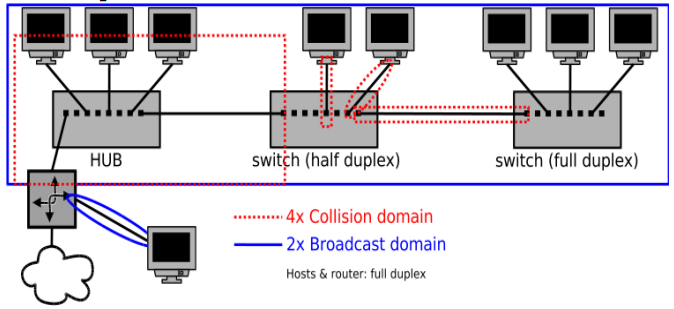
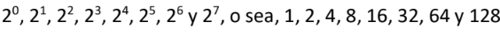
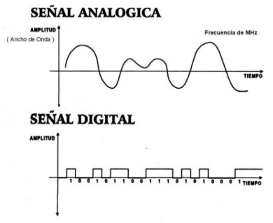

# Resumen Redes de Datos I primer parcial

## Conceptos básicos.

* LAN (Red de área Local)
    * Misma área geográfica
    * Estructura organizacional común
    * Administrada por una única organización
* WAN (Redes de área amplia)
    * Ubicaciones separadas geográficamente
    * Dispositivos de red especiales
* Comunicación half-duplex
    * Los dispositivos pueden transmitir y recibir en el medio pero no al mismo tiempo
* Comunicación full-duplex
    * Los dispositivos pueden transmitir y recibir en el medio al mismo tiempo
* Topología física (Bus, Anillo, Doble Anillo, Estrella, Malla, Árbol, Mixta)
    * Disposición real de medios (en el entorno físico)
    * Configuración de nodos y conexiones
    * Representación de uso de los medios
* Topología lógica (Broadcast / transmisión de tokens)
    * Maneras de transmitir paquetes
    * Conexiones virtuales
* Dispositivos de usuario final
    * Computadoras
    * Celulares
    * Impresoras
    * IOT
* Dispositivos de Red
    * Repetidores
    * Hubs
    * Puentes
    * Switches
    * Routers
    * Firewalls

* ASCII
    * usa dígitos binarios para representar los símbolos que se escriben con el teclado
* Bits
    * número binario (0 = 0 Voltios / 1 = +5V)
* Bytes
    * agrupaciones de ocho bits
* Sistema numérico de Base 2

* Hexadecimal (hex)
    * son los números 0 - 9 y las letras A, B, C, D, E y F
    * La palabra hexadecimal a menudo se abrevia como 0x
    * 0x2102 = 0010000100000010
* Dominio de colisión
    * espacio físico con un ancho de banda compartido por un conjunto de dispositivos
    * existe la posibilidad de que sus mensajes colisionen el espacio compartido o bien no se pueda asegurar que al receptor le ha llegado el mensaje
    * Para resolverlo, Ethernet implementa CSMA/CD (Carrier dense multiple access with collision detection).
    * Rendimiento = (1-(Colisiones/Paquetes Totales))*100
* Dominio de difusión (Broadcast)
    * El dominio de difusión es la división lógica de la red dentro de la cual los dispositivos envían mensajes de difusión, también llamados broadcast.switch
    * Dos dispositivos dentro del dominio de difusión comparten puerta de enlace (gateway), dirección de subred y pueden transmitir a otro dispositivo dentro del dominio sin precisar encaminamiento; es decir, se encuentran en la misma LAN
    * Los dominios broadcast o de difusión están delimitados por routers
* HUBS
    * concentradores extienden el dominio de colisión ya que reenvían todos los mensajes que reciben de un dispositivo a los otros dispositivos conectados.
* SWITCHES
    * conmutadores segmentan los dominios de colisión, pero expanden el dominio de difusión
* ROUTERS
        ◦ también segmentan los dominios de colisión, pero además también lo hacen con los de difusión

> ROUTER (R1). Ordenador 5 se encuentra en un solo dominio de difusión, al igual que el ordenador 6; el resto (1,2 y 3) se encuentran en otro. Hay 3 dominios de difusión. Los dominios de colisión están señalizados con un circulo en la imagen. El HUB extiende el dominio de colisión, por eso el Dominio de Colisión 1 tiene 3 dispositivos conectados.

* MULTIPLEXACION
    * Técnica de combinar dos o más señales, y transmitirlas por un solo medio de transmisión
    * Multiplexación por división de frecuencias (FDM)
    * Multiplexación por división en el tiempo (TDM).
    * Técnicas combinadas
* Medicion
    * Ancho de banda
    * Throughput
    * Tasa de conexión
    * Velocidad de descarga / carga
* Señales

